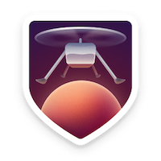

# GitHub Profile Achievements 🏆

Welcome to the marvelous world of GitHub Profile Achievements! 🚀🎉

Following the successful launch of the first Mars Helicopter, Ingenuity, GitHub couldn't help but be inspired by the spirit of exploration and innovation! That's why they proudly introduced the new Achievements section to your GitHub profile. Let's make your profile shine with accomplishments!

## What's New? 📢

As of June 9, 2022, GitHub announced even more Achievements! 🎉 While they haven't shared specific criteria for some badges yet, we've got you covered with a collection of all known Achievements.

But hey, we're not rigid here! If you spot something missing or have a brilliant idea for a new Achievement, please open an issue. Your input is invaluable! 🙌

### Don't Like 'Em? No Worries! 😎

Not feeling the Achievements vibe? No problemo! You have the power to disable them. Simply follow this [handy guide](https://docs.github.com/account-and-profile/setting-up-and-managing-your-github-profile/managing-contribution-settings-on-your-profile/showing-your-private-contributions-and-achievements-on-your-profile#changing-the-visibility-of-achievements). You're in control!

## The Glory of Achievements 🏅

Behold the list of prestigious Achievements that await you:

| Title | Badge | Earnable? | Earned by |
| --- | --- | --- | --- |
Heart On Your Sleeve |  | 🔜 (Being tested) | React to something on GitHub with a ❤️ emoji 
Open Sourcerer |  | 🔜 (Being tested) | User had PRs merged in multiple public repositories 
||| <!-- this empty row is intentional to separate -->
Pair Extraordinaire |  | ✔️ | [Coauthored](https://docs.github.com/pull-requests/committing-changes-to-your-project/creating-and-editing-commits/creating-a-commit-with-multiple-authors) in a merged pull request
Quickdraw |  | ✔️ | Closed an issue or a pull request within 5 min of opening
Starstruck |  | ✔️ | Created a repository that has 16 stars
||| <!-- this empty row is intentional to separate -->
Galaxy Brain |  | ✔️ | 2 accepted answers
Pull Shark |  | ✔️ | 2 pull requests merged
YOLO |  | ✔️ | Merged own pull request without code review
||| <!-- this empty row is intentional to separate -->
Arctic Code Vault Contributor |  | ❌ | Contributed code to repositories in the [2020 GitHub Archive Program](https://archiveprogram.github.com/)
Public Sponsor |  | ✔️ | Sponsoring open source work via [GitHub Sponsors](https://github.com/sponsors)
Mars 2020 Contributor |  | ❌ | Contributed code to repositories used in the [Mars 2020 Helicopter Mission](https://github.com/readme/nasa-ingenuity-helicopter)

## Climb the Tiers! 🏅🌟

But wait, there's more! Some Achievements come in tiers, showcasing your increasing brilliance. Check them out:

| Title | Tier | Badge | Earned by |
| --- | --- | --- | --- |
Pair Extraordinaire x2 | Bronze 🥉 |  | Coauthored in 10 merged pull requests
Pair Extraordinaire x3 | Silver 🥈 |  | Coauthored in 24 merged pull requests
Pair Extraordinaire x4 | Gold 🥇 |  | Coauthored in 48 merged pull requests
Starstruck x2 | Bronze 🥉 |  | Created a repository that has 128 stars
Starstruck x3 | Silver 🥈 |  | Created a repository that has 512 stars
Starstruck x4 | Gold 🥇 |  | Created a repository that has 4096 stars
||| <!-- this empty row is intentional to separate -->
Galaxy Brain x2 | Bronze 🥉 |  | 8 accepted answers
Galaxy Brain x3 | Silver 🥈 |  | 16 accepted answers
Galaxy Brain x4 | Gold 🥇 |  | 32 accepted answers
Pull Shark x2 | Bronze 🥉 |  | 16 pull requests merged
Pull Shark x3 | Silver 🥈 |  | 128 pull requests merged
Pull Shark x4 | Gold 🥇 |  | 1024 pull requests merged

## Official List 📜

Previously, an official list was available in the GitHub Docs, showcasing all the glorious Achievements. You can still find some details in the [archived version](https://web.archive.org/web/20220531023858/https://docs.github.com/en/account-and-profile/setting-up-and-managing-your-github-profile/customizing-your-profile/personalizing-your-profile#displaying-badges-on-your-profile). While it's no longer official, consider this repository the ultimate source for your Achievements! 💪

## How to Achieve! 🎯

Curious about the specifics on how to achieve certain badges? No worries, we got you covered! Check out the [discussions](https://github.com/Schweinepriester/github-profile-achievements/discussions) for all the juicy details. And here are a couple of pointers to get you started:

- [Galaxy Brain](https://github.com/Schweinepriester/github-profile-achievements/discussions/9#discussioncomment-2927413)
- [YOLO](https://github.com/Schweinepriester/github-profile-achievements/discussions/6#discussioncomment-2934257)

## Tier Labels - Wear Them Proudly! 🎉

Each tier of Achievements comes with its unique label and color, signifying your accomplishments:

| Tier | Label | Sample | Hex | Visual |
| --- | --- | --- | --- | --- |
Bronze 🥉 | x2 |  | #F9BFA7 | 
Silver 🥈 | x3 |  | #E1E4E4 | 
Gold 🥇 | x4 |  | #FAE57E | 

## 100 % Unlocked - See the Glory! 🎊

Want to witness the Achievements in their full glory at 100% unlocked? We've got you covered! Feast your eyes on live samples by some awesome GitHub users:

- Pair Extraordinaire: [Live 100% unlocked sample by @Rongronggg9](https://github.com/Rongronggg9?achievement=pair-extraordinaire&tab=achievements)
- Quickdraw: [Live 100% unlocked sample by @Schweinepriester](https://github.com/Schweinepriester?achievement=quickdraw&tab=achievements)
- Starstruck: [Live 100% unlocked sample by @torvalds](https://github.com/torvalds?achievement=starstruck&tab=achievements)
- Galaxy Brain: [Live 100% unlocked sample by @ljharb](https://github.com/ljharb?achievement=galaxy-brain&tab=achievements)
- Pull Shark: [Live 100% unlocked sample by @ljharb](https://github.com/ljharb?achievement=pull-shark&tab=achievements)
- YOLO: [Live 100% unlocked sample by @Schweinepriester](https://github.com/Schweinepriester?achievement=yolo&tab=achievements)
- Arctic Code Vault Contributor: [Live 100% unlocked sample by @Schweinepriester](https://github.com/Schweinepriester?tab=achievements&achievement=arctic-code-vault-contributor)
- Public Sponsor: [Live 100% unlocked sample by @ljharb](https://github.com/ljharb?tab=achievements&achievement=public-sponsor)
- Mars 2020 Contributor: [Live 100% unlocked sample by @torvalds](https://github.com/torvalds?achievement=mars-2020-contributor&tab=achievements)

## More Fun on GitHub! 🎉

Explore other hilarious GitHub repositories like [Flet/rejected-github-profile-achievements](https://github.com/Flet/rejected-github-profile-achievements) for a good laugh about the Achievements. For a similar collection but with a twist, check out [drknzz/GitHub-Achievements](https://github.com/drknzz/GitHub-Achievements).

## Highlights - Make Them Pop! ✨

You can also add Highlights to your GitHub profile, showcasing your most cherished badges prominently. For more information on customizing your profile and displaying badges as Highlights, check out the [official GitHub docs](https://docs.github.com/account-and-profile/setting-up-and-managing-your-github-profile/customizing-your-profile/personalizing-your-profile#displaying-badges-on-your-profile).

## Previous Versions - A Nostalgic Journey 🕰️

From the start with Ingenuity on April 19, 2021, until the grand additions on June 9, 2022, the first three Achievements had slightly different designs and names. Ah, the good old days! They got a glorious makeover in 2022:

```diff
- GitHub Sponsor
+ Public Sponsor
- Mars 2020 Helicopter Contributor
+ Mars 2020 Contributor
```

Take a moment to remember the classics:

| Title | Badge |
| --- | --- |
Arctic Code Vault Contributor | 
GitHub Sponsor | 
Mars 2020 Helicopter Contributor | 

## See also - More GitHub Adventures! 🚀

Your journey into the GitHub Profile Achievements world doesn't have to end here! For even more laughter and inspiration, check out these awesome repositories:

- [Flet/rejected-github-profile-achievements](https://github.com/Flet/rejected-github-profile-achievements) - For a good laugh about the Achievements that didn't make the cut.
- [drknzz/GitHub-Achievements](https://github.com/drknzz/GitHub-Achievements) - Similar to this collection, but with a unique twist!

## Embrace the Achievements! 🌟

Whether you're a code guru, an open-source enthusiast, or just a GitHub explorer, these Achievements add a touch of fun and pride to your GitHub profile. Share your accomplishments, celebrate your contributions, and inspire others to join the exciting world of software development!

Remember, the Achievements are all about recognizing your coding journey and celebrating the many stages of your progress. So, keep coding, keep exploring, and keep achieving!

Now go forth and conquer new coding frontiers! Happy coding! 🚀🎉

---
This has been a delightful journey through the world of GitHub Profile Achievements! If you have any more requests or need further assistance, feel free to ask. Happy coding and exploring! 🌟